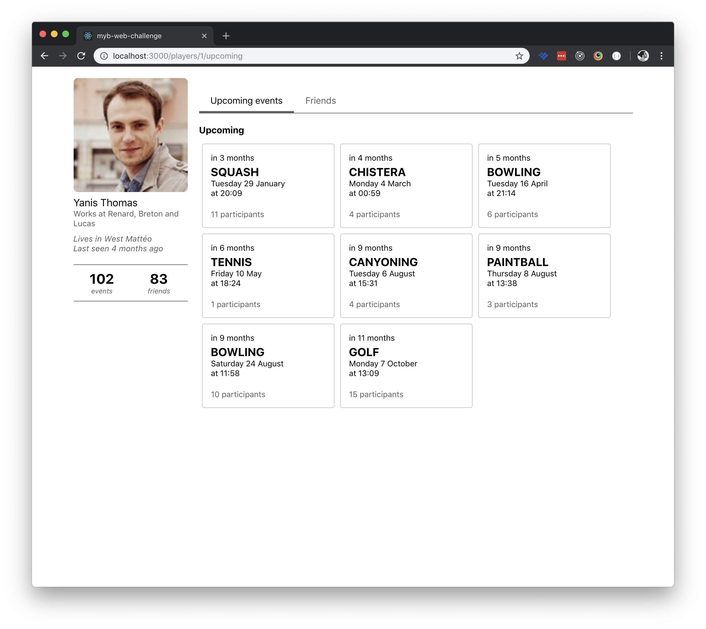
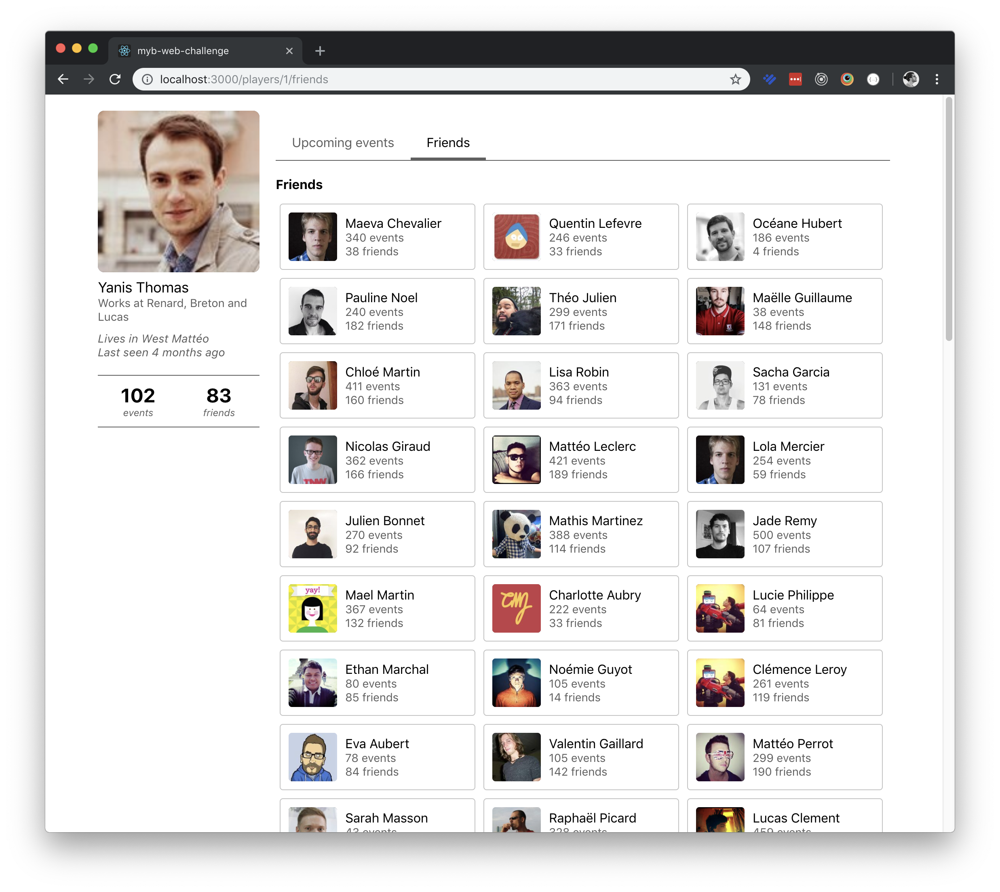

# 

## Instructions

Hello, and welcome to the main repository for the **Quiz Arena Web Challenge**. This challenge is intended to see how comfortable you are using React, which makes up for most of our stack. In this test, you are expected to code in `TypeScript`.

The challenge is divided in multiple levels of increasing difficulty. You have to finish those levels in order, as every level depends on the previous one.

Once your reach level 3, you'll need to start making API calls to a server. The documentation for the server is available [here](docs/api.md).

**Important**

In order for us to verify your progress, you'll need to have at least one commit for each level. You can host your repository privately on your Github profile and add us a collaborators (maxime@quizarena.com), or send us a copy of the entire directory (including the .git directory) at dev@quizarena.com.

If you have any questions regarding the challenge, don't hesitate to send us an email at dev@quizarena.com.

## Let's go!

What you are going to build is a web app where you can simply see the profile of a Player. That's it.

On the Profile page, there is a panel on the left that shows basic informations about the Player and two tabs: one with all of the upcoming events a Player has, and one with all of their friends.

<details>
  <summary>
    <b>Screenshots of the app</b>
    <br />
    <br />
  </summary>

  
  

</details>

The app is divided in three main blocks, that we'll build as separate components.

#### `<UserPanel />`

The `UserPanel` is reponsible for presenting basic informations about the Player, like his name and the city he came from. It is the panel that is located on the left side of the page.

#### `<UpcomingEventsTab />`

The `UpcomingEventsTab` shows, you guessed it, the upcoming events for a player. These events are sorted by date, and grouped in different categories (this week, next week, this month, next month, this year, others).

#### `<FriendsTab />`

This `FriendsTab` simply shows the list of friends a player has. When the User clicks on a Player Card, he's redirected to the Player's profile.

---

### Level #0 - Boilerplate

Since this is the first level, let's start easy.

Create the project structure. We recommend using Vite, but you can use something else if you want to, as long as we can run the project with a simple `npm run dev`.

In this test, you are expected to code using `TypeScript`.

> **Level #0 - Checklist**
>
> - [ ] Prepare the project structure

---

### Level #1 - Build the UI

Now that you are setup, let's start coding.

First, let's build the UI. Here, we want you to focus only on the styling of the components. The goal is to reproduce the look you can see on the screenshots. This means that you need to use hard-coded data in our components (either from the screenshots, or you can make up your own).

For styling, you can either use plain old css, or a library of your choice (at QA, we tend to use `emotion`).

Try to reproduce the UI as closely as possible. We'll be looking at how well you can reproduce the design.

For now, just show the two tabs at the same time (one under the other). Implementing the "logic" behind the `<TabBar />` is the focus of the next level (spoilers!).

Your `ProfilePage.tsx` should somewhat look like this:

```ts
function ProfilePage() {
  return (
    <Container>
      <UserPanel />

      <Content>
        <TabBar>
          <TabBar.Link title="Upcoming events" active />
          <TabBar.Link title="Friends" />
        </TabBar>

        <UpcomingEventsTab />
        <FriendsTab />
      </Content>
    </Container>
  );
}
```

> **Level #1 - Checklist**
>
> - [ ] Create the `<ProfilePage />` component (UI only)
> - [ ] Create the `<UserPanel />` component (UI only)
> - [ ] Create the `<TabBar />` component (UI only)
> - [ ] Create the `<UpcomingEventsTab />` component (UI only)
> - [ ] Create the `<FriendsTab />` component (UI only)

---

### Level #2 - Build `<Tabs />`

Good job! Great, now that we are done pushing pixels, let's implement the Tabs.

Create a `<Tabs />` component, responsible for:

- Holding state about which tab is currently active
- Rendering the Tab Bar
- Rendering the active tab

We expect the component to be used like this:

```ts
function ProfilePage() {
  return (
    <Container>
      <UserPanel />

      <Content>
        <Tabs>
          <UpcomingEventsTab title="Upcoming events" />
          <FriendsTab title="Friends" />
        </Tabs>
      </Content>
    </Container>
  );
}
```

You can see that the `<Tabs />` component relies on its children to know which tabs to show. It uses the `title` prop on these children to know what title to use in the `<TabBar />` component.

By default, it renders the first tab, but when you click on a different tab in the `<TabBar />`, the `<Tabs />` component is responsible for tracking which tab is active and rendering it.

> **Level #2 - Checklist**
>
> - [ ] Implement the `<Tabs />` component

---

### Level #3 - Build `<Fetch />`

All right, well done! Good, now that we have the basics covered, it's time to use some real data. For now, we'll assume that we are viewing the profile of the Player with id=1.

Create a `<Fetch />` component, responsible for making the requests to the API and handling all the different states that can occur. At this stage you should use the API v1.

Then, use it in `<UserPanel />`, `<UpcomingEventsTab />`, and `<FriendsTab />` to show real data about the Player.

We expect the component to be used like this:

```ts
function UserPanel() {
  return (
    <Fetch path="/players/1">
      {({ isFetching, hasFailed, data }) => {
        // Render our component
      }}
    </Fetch>
  );
}
```

The `<Fetch />` component receives which call to make to the API through its `path` prop. It also takes a render prop as its children to pass the progress and result of the API call.

Don't forget to handle the loading and the error state in your components!

> **Level #3 - Checklist**
>
> - [ ] Implement the `<Fetch />` component
> - [ ] Use `<Fetch />` in `<UserPanel />`
> - [ ] Use `<Fetch />` in `<UpcomingEventsTab />`
> - [ ] Use `<Fetch />` in `<FriendsTab />`

---

### Level #4 - Migrate from `<Fetch />` to `useFetch`

We've been using the `<Fetch />` component to make our API calls. Now, let's migrate to hooks.

Write your own custom `useFetch` hook, and use it in `<UserPanel />`, `<UpcomingEventsTab />`, and `<FriendsTab />`. As before, be sure to handle the loading and error states.

The `useFetch` hook should be used like this:

```ts
function Component() {
  const { isFetching, hasFailed, data } = useFetch("/players/1");

  // Render our component
}
```

> **Level #4 - Checklist**
>
> - [ ] Implement the `useFetch` hook
> - [ ] Use `useFetch` in `<UserPanel />`
> - [ ] Use `useFetch` in `<UpcomingEventsTab />`
> - [ ] Use `useFetch` in `<FriendsTab />`

### Level #5 - Use a `<Router />`

Okay, now that our components are using data from the server, we can start showing different Player profiles when the User clicks on a Player in the Friends tab.

To do that, you'll need to use a Router. You can use any Routing library your are familiar with.

Here are the routes you need to implement:

- `/`: Redirects to `/players/1/upcoming`
- `/players/:id`: Redirects to `/players/:id/upcoming`
- `/players/:id/upcoming`: Shows the Upcoming Tab
- `/players/:id/friends`: Shows the Friends Tab

This means that we won't use the `<Tabs />` component for keeping track of which tab is active anymore. This is the Router's job now.

> **Level #5 - Checklist**
>
> - [ ] Install the Router of your choice
> - [ ] Get rid of `<Tabs />`
> - [ ] Implement the routes
> - [ ] Allow navigating between Profiles through the `<FriendsTab />`

---

### Level #6 - Context & Authentication

Now that we have a working app, let's add some security to it. We want the app to be protected by a login page. When the User is not authenticated, he should be redirected to the login page.

From now on, you should use the API v2, which requires a token to make the requests. You can get a token by calling the `/login`. In exchange, you'll receive a token that you can use to authenticate your requests.

To keep track of the User's authentication status, you'll need to create a Context `AuthContext`.

The `AuthContext` should have the following methods/properties:

- `login(username, password)`: Logs the User in
- `logout`: Logs the User out
- `isAuthenticated`: Returns whether the User is authenticated or not
- `token`: Returns the User's token used to authenticate the API calls

Once you have the `AuthContext` working, update the `useFetch` hook to use the API v2 when making the requests. If the requests fail because the User is not authenticated, redirect the User to the login page.

You'll also need do implement the following routes and pages:

- `/login`: Shows the login page
- `/logout`: Logs the User out and redirects to the login page

You can keep the design of the login page simple, but it should be functional.

> **Level #6 - Checklist**
>
> - [ ] Create the `AuthContext`
> - [ ] Update the `useFetch` to use the API v2
> - [ ] Implement a login page
> - [ ] Implement a logout page
> - [ ] Protect the routes by redirecting to the login page when the User is not authenticated

---

### Congratulations 🎉

Well done! You've finished the **web-challenge**.

You can be proud of what you have done! We hope that you had fun and thank you for taking the time to take the challenge. We'll be in touch soon.
